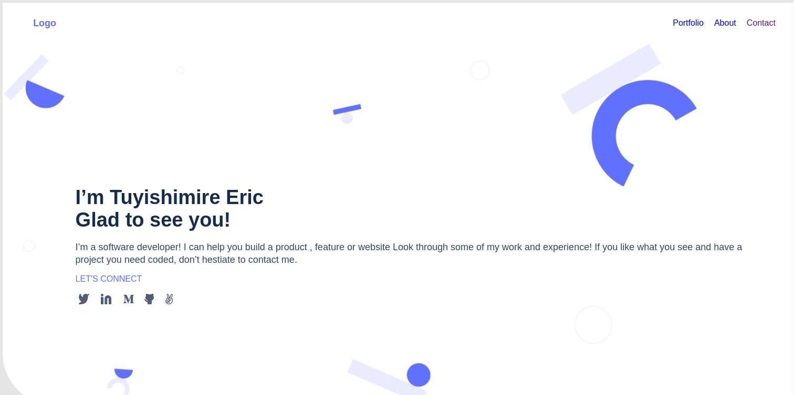

# My projects and about section 
 
> Portfolio is project which highlights and showcases samples of some of best work, learning progress, and academic achievement in software development.

## Built With

- HTML 
- CSS
- javaScript

## Project link

[Project Link](https://tuyishimireeric.github.io/)

## Getting Started
To get a local copy, just follow the steps That I am going to mention bellow:

### Prerequisites

### Setup
To get this project in your local machine, follow these steps:
- Open terminal 
- clone the repository :https://github.com/TuyishimireEric/Portfolio-mobile-version-2.git
- Cd in the project folder
- run the project in your browser

### install
 - run npm install to install the required linters

 ### tests
 - run the project in the browsers 
 - use google tool to inspect and check in mobile version.

## Authors

👤 **Tuyishimire Eric**

- GitHub: [@TuyishimireEric](https://github.com/TuyishimireEric)
- LinkedIn: [@TuyishimireEric](https://www.linkedin.com/in/Tuyishimire-Eric-32426b21a/)

## 🤝 Contributing

Contributions, issues, and feature requests are welcome!

Feel free to check the [issues page](../../issues/).

## Show your support

Give a ⭐️ if you like this project!

## 📝 License

This project is [MIT](./MIT.md) licensed.
